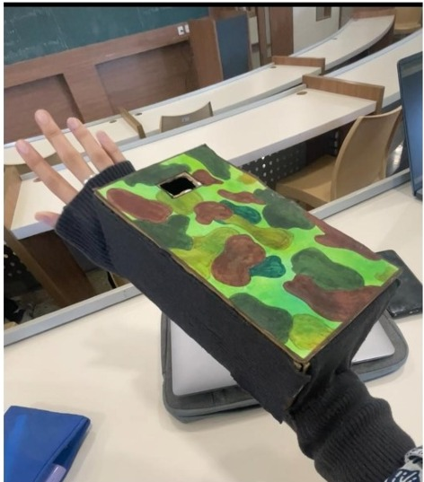
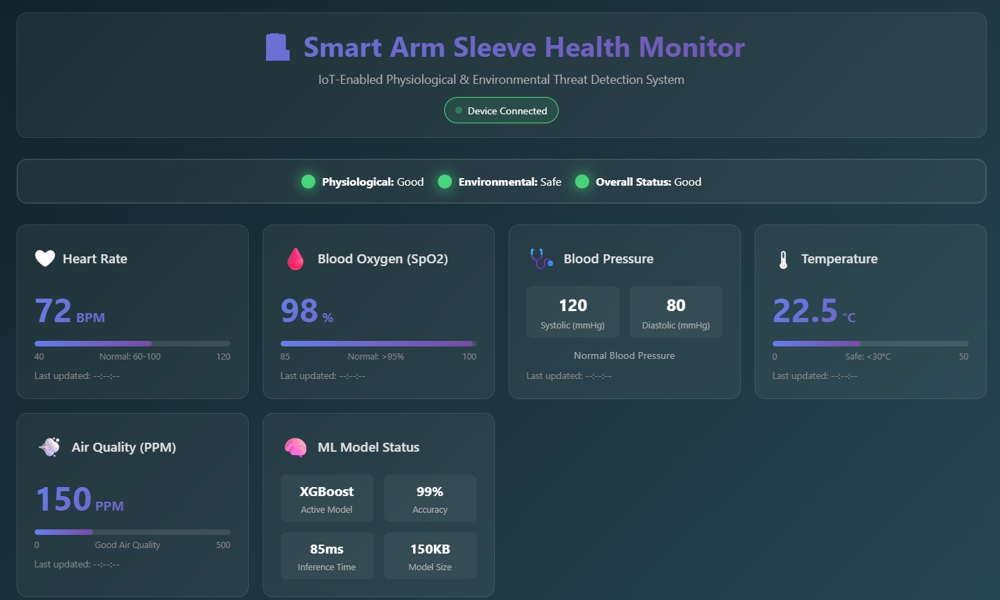
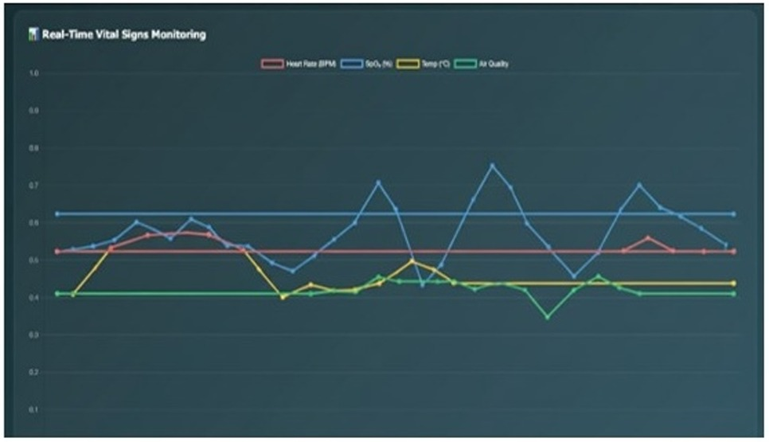

# Smart Arm Sleeve Health Monitor

> IoT-Enabled Physiological & Environmental Threat Detection System

An intelligent wearable arm sleeve that monitors real-time vital signs (heart rate, SpO2, blood pressure, body temperature) and environmental conditions (air quality), using on-device ML models for health anomaly detection and risk assessment.

**Built at MIT World Peace University | Department of Computer Engineering**

**Author:** Jinesha Gandhi

---

## Table of Contents

- [Overview](#overview)
- [Features](#features)
- [System Architecture](#system-architecture)
- [Hardware Components](#hardware-components)
- [Software Stack](#software-stack)
- [Project Structure](#project-structure)
- [ML Pipeline](#ml-pipeline)
- [Dashboard](#dashboard)
- [Getting Started](#getting-started)
- [Pin Configuration](#pin-configuration)
- [How It Works](#how-it-works)
- [Results](#results)
- [License](#license)

---

## Overview

The Smart Arm Sleeve is a wearable IoT device designed for continuous health monitoring and environmental threat detection. It combines multiple sensors with machine learning models to provide real-time health status classification (Good / Moderate / Risk) through a fusion of physiological and environmental data.

The system runs on a **Raspberry Pi Pico W** microcontroller, performs edge inference using trained ML models, and serves a real-time web dashboard over WiFi for visualization.


---

## Features

- **Real-time vital sign monitoring** - Heart rate, SpO2, blood pressure (estimated), body temperature
- **Environmental sensing** - Air quality (CO2/PPM) via MQ-135 gas sensor
- **On-device ML inference** - XGBoost-based health classification with 99% accuracy
- **Dual-model fusion** - Combines physiological + environmental risk scores for overall health status
- **Visual alerts** - LED indicators (Green/Yellow/Red) and buzzer alarms for critical conditions
- **Web dashboard** - Real-time Chart.js-powered monitoring dashboard served over WiFi
- **Low power** - 60+ hours battery life, 235ms system latency, 85ms inference time
- **Compact wearable design** - Camouflage-painted arm sleeve enclosure

---

## System Architecture

The system uses a two-model fusion architecture:

```
                    +-------------------+
                    |   Sensor Layer    |
                    +-------------------+
                    |  MAX30102 (HR/SpO2)|
                    |  DS18B20 (Temp)    |
                    |  MQ-135 (Air)      |
                    +---------+---------+
                              |
                    +---------v---------+
                    |  Raspberry Pi     |
                    |  Pico W           |
                    +---------+---------+
                              |
                   +----------+----------+
                   |                     |
          +--------v--------+  +--------v--------+
          | Physiological   |  | Environmental   |
          | Model (XGBoost) |  | Model (TFLite)  |
          | HR, SpO2, BP,   |  | Temp, Air PPM   |
          | Temp             |  |                 |
          +--------+--------+  +--------+--------+
                   |                     |
                   +----------+----------+
                              |
                    +---------v---------+
                    |  Risk Fusion      |
                    |  max(physio, env)  |
                    +---------+---------+
                              |
              +---------------+---------------+
              |               |               |
        +-----v-----+  +-----v-----+  +------v------+
        | LED Status |  | Buzzer    |  | WiFi Web    |
        | G / Y / R  |  | Alarm     |  | Dashboard   |
        +------------+  +-----------+  +-------------+
```

---

## Hardware Components

| Component | Model | Purpose |
|-----------|-------|---------|
| Microcontroller | Raspberry Pi Pico W | Main controller with WiFi |
| Pulse Oximeter | MAX30102 | Heart rate & SpO2 measurement |
| Temperature Sensor | DS18B20 | Body/ambient temperature |
| Gas Sensor | MQ-135 | Air quality (CO2 PPM) |
| LEDs | Green/Yellow/Red | Visual health status indicator |
| Buzzer | Passive Buzzer | Critical condition alarm |
| Power | USB / Battery Pack | Portable power supply |

### Hardware Setup

<p align="center">
  
  
</p>

---

## Software Stack

| Layer | Technology |
|-------|-----------|
| Firmware | MicroPython on Raspberry Pi Pico W |
| ML Training | Python, scikit-learn, XGBoost, imbalanced-learn |
| ML Inference | Exported model weights (LogisticRegression in C header) |
| Dashboard | HTML5, CSS3, JavaScript, Chart.js |
| Communication | HTTP REST API over WiFi |
| Data Processing | Pandas, NumPy, Matplotlib, Seaborn |

---

## Project Structure

```
IOT-ML/
├── README.md                          # This file
├── LICENSE                            # MIT License
├── .gitignore                         # Git ignore rules
├── requirements.txt                   # Python dependencies
│
├── firmware/                          # Raspberry Pi Pico W code
│   ├── main.py                        # Main sensor loop & ML inference
│   ├── server.py                      # WiFi HTTP server for dashboard
│   ├── max30102.py                    # MAX30102 pulse oximeter driver
│   ├── hrcalc.py                      # Heart rate & SpO2 calculation
│   ├── ds18x20.py                     # DS18B20 temperature driver
│   ├── onewire.py                     # OneWire protocol driver
│   ├── mq135.py                       # MQ-135 gas sensor driver
│   ├── health_model.pkl               # Serialized ML model
│   ├── model.h                        # C header with model weights
│   └── I2C_test.py                    # I2C diagnostic utility
│
├── ml/                                # ML training & analysis
│   ├── health_anomaly.py              # Model training pipeline
│   ├── environment.ipynb              # Environmental model notebook
│   └── evn_adv_mliot.ipynb            # Advanced ML analysis notebook
│
├── dashboard/                         # Web monitoring dashboard
│   └── dashboard.html                 # Real-time health dashboard
│
├── data/
│   └── final_dataset.csv              # Training dataset
│
├── docs/
│   ├── images/                        # Project images
│   │   ├── system_architecture.jpg
│   │   ├── hardware_breadboard.jpg
│   │   ├── wearable_prototype.jpg
│   │   ├── dashboard_screenshot.png
│   │   └── realtime_chart.png
│   └── WIRING.md                      # Hardware wiring guide
│
└── IoT Raspberry pico codes/          # Original development code
    ├── dashboard.py                   # Pico W HTTP server (dev)
    └── IoT/                           # Sensor drivers & test scripts
```

---

## ML Pipeline

### Data Processing
1. **Dataset**: Real physiological data (heart rate, systolic/diastolic BP, temperature, SpO2)
2. **Clustering**: K-Means (k=3) with silhouette score validation for unsupervised labeling
3. **Labels**: `Good`, `Moderate`, `Risk` — assigned based on cluster centroid risk scoring

### Models Evaluated
| Model | Regularization | Avg Accuracy |
|-------|---------------|--------------|
| Logistic Regression | L2 (C=0.1) | ~97% |
| Decision Tree | max_depth=4, min_samples_leaf=10 | ~96% |
| K-Nearest Neighbors | k=10 | ~98% |
| **XGBoost** | L1+L2 (alpha=0.5, lambda=1) | **~99%** |

### Key Techniques
- **SMOTE** oversampling for class imbalance
- **5-Fold Stratified Cross-Validation** for robust evaluation
- **Regularization** on all models to prevent overfitting
- **Edge deployment** — model weights exported to C header for microcontroller inference

### Dual-Model Fusion
The system fuses two independent predictions:
- **Physiological Model**: Classifies health based on vitals (HR, SpO2, BP, Temp)
- **Environmental Model**: Classifies environment risk based on temperature and air quality

Final status = `max(physiological_risk, environmental_risk)`

---

## Dashboard

The real-time web dashboard displays all sensor readings with live Chart.js graphs.




### Dashboard Features
- Live heart rate, SpO2, blood pressure, temperature, air quality cards
- Color-coded status indicators (Good/Moderate/Risk)
- Real-time line chart with last 15 data points
- Critical alert banners with specific warnings
- ML model status panel (accuracy, inference time, model size)
- Responsive design for mobile and desktop

---

## Getting Started

### Prerequisites
- Raspberry Pi Pico W with MicroPython firmware
- MAX30102, DS18B20, MQ-135 sensors
- Python 3.8+ (for ML training)

### 1. Install Python Dependencies (for ML training)
```bash
pip install -r requirements.txt
```

### 2. Flash Firmware
1. Download MicroPython firmware for Pico W from [micropython.org](https://micropython.org/download/RPI_PICO_W/)
2. Hold BOOTSEL button, connect Pico via USB, drag `.uf2` file to the drive
3. Upload all files from `firmware/` directory to the Pico using Thonny IDE

### 3. Configure WiFi
Edit `firmware/server.py` and update WiFi credentials:
```python
SSID = "Your_WiFi_Name"
PASSWORD = "Your_WiFi_Password"
```

### 4. Run the Dashboard
```bash
# Serve the dashboard locally
cd dashboard/
python -m http.server 8000
# Open http://localhost:8000/dashboard.html
```

Update the `PICO_URL` in `dashboard.html` to match your Pico's IP address.

### 5. Train ML Models (Optional)
```bash
python ml/health_anomaly.py
```

---

## Pin Configuration

| Pin (Pico W) | GPIO | Component | Function |
|-------------|------|-----------|----------|
| Pin 6 | GP4 | MAX30102 | I2C SDA |
| Pin 7 | GP5 | MAX30102 | I2C SCL |
| Pin 2 | GP1 | DS18B20 | OneWire Data |
| Pin 31 | GP26 (ADC0) | MQ-135 | Analog Input |
| Pin 21 | GP16 | Green LED | Status Good |
| Pin 22 | GP17 | Yellow LED | Status Moderate |
| Pin 24 | GP18 | Red LED | Status Risk |
| Pin 25 | GP19 | Buzzer | Critical Alarm |

> **Note:** DS18B20 requires a 4.7k ohm pull-up resistor between Data and 3.3V.

---

## How It Works

1. **Sensor Reading** (High frequency): MAX30102 continuously samples IR/Red LED data, calculates heart rate and SpO2
2. **Environmental Sampling** (Every 5s): DS18B20 reads temperature, MQ-135 reads air quality PPM
3. **ML Inference**: Physiological model predicts health state; Environmental model predicts safety level
4. **Fusion**: Final status = worst-case of both models
5. **Output**: LEDs reflect status, buzzer sounds on critical SpO2 (<94%) or high temperature (>30C)
6. **Dashboard**: Pico W serves JSON data over HTTP; browser dashboard fetches every 3 seconds

---

## Results

- **Model Accuracy**: 99% (XGBoost with regularization)
- **Inference Time**: ~85ms on Pico W
- **Model Size**: 150KB
- **System Latency**: 235ms end-to-end
- **Battery Life**: 60+ hours on portable battery pack

---

## License

This project is licensed under the MIT License - see the [LICENSE](LICENSE) file for details.

---

## Acknowledgments

- MIT World Peace University, Department of Computer Engineering
- MicroPython community for Pico W support
- Open-source sensor driver libraries (MAX30102, MQ135)
- [VitalDB](https://vitaldb.net/) for physiological dataset inspiration
